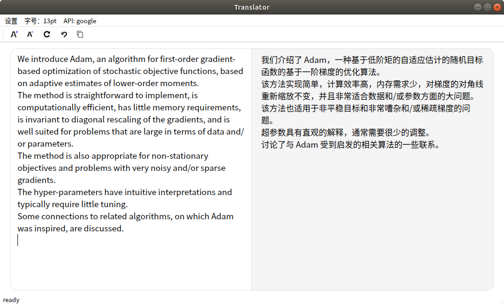

# TransGui
a pyqt-based translator gui, with following features:
- capture clipboard
- remove space and newlines
- multi translation source, including google, baidu and youdao



for google, depending on `googletrans` api; the others need correspondent account.

Only supports translation from English to Chinese. 

Usage:
```shell
git clone https://github.com/JewelryForge/TransGui.git
cd TransGui
pip3 install -r requirements.txt
python gui.py
```